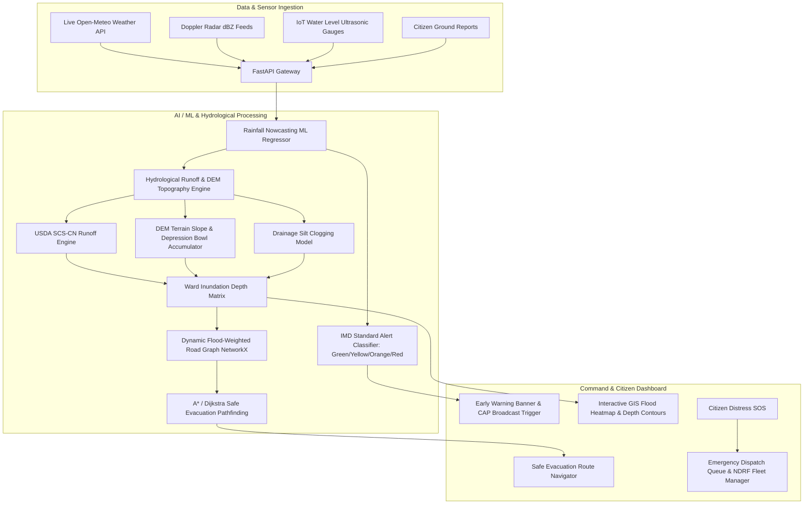

# 🌊 JalPrahari AI (जल प्रहरी)
### AI/ML-Based Integrated Heavy Rainfall Early Warning and Inundation Prediction System
**Official Ready-to-Submit Prototype for Smart India Hackathon (SIH 2026)**

[](https://fastapi.tiangolo.com)
[](https://reactjs.org)
[](https://vitejs.dev)
[](https://leafletjs.com)
[](https://scikit-learn.org)
[](https://networkx.org)

---

## 📌 Executive Overview

Urban flash floods triggered by sudden cloudbursts and extreme rainfall events cause massive economic devastation and loss of life across Indian metropolitan cities every monsoon. Existing municipal solutions rely on coarse city-wide weather forecasts and reactive physical drainage checks, lacking the ability to forecast **where and how many centimeters of water will accumulate hours before roads submerge**.

**JalPrahari AI** is an end-to-end, real-time Early Warning and Inundation Prediction platform that integrates:
1. **Atmospheric AI Rainfall Nowcasting**: Multi-horizon precipitation forecasting ($1h, 3h, 6h, 24h$) trained on Doppler Radar reflectivity ($\text{dBZ}$), $\text{CAPE}$, barometric pressure deficits, and relative humidity with automated **IMD Color-Coded Warnings (Green / Yellow / Orange / Red)**.
2. **DEM & Hydrological Runoff Modeling**: USDA Soil Conservation Service Curve Number (SCS-CN) runoff equations combined with Digital Elevation Models (DEM), terrain slopes ($\theta$), and stormwater drainage throughput to compute localized ward water depths ($0.1m - 3.5m$).
3. **Dynamic Flood-Aware Evacuation Routing**: Graph-based pathfinding (Dijkstra / A*) that dynamically recalculates edge costs based on real-time water inundation depth, navigating ambulances and fleeing citizens around flooded chokepoints directly to high-ground relief centers.
4. **Citizen SOS Distress Portal & Crowdsourced Ground-Truth**: Direct crisis response linking trapped citizens broadcasting GPS distress signals with NDRF rescue fleet dispatch.

---

## 🏗️ System Architecture



---

## 🚀 Quick Start & Installation

### Option 1: 1-Click Windows Launcher
Double click `start.bat` in the project root to start both backend and frontend automatically.

### Option 2: Manual Terminal Execution

#### 1. Start the FastAPI Backend
```bash
cd backend
pip install -r requirements.txt
python run.py
```
*Backend runs on: `http://127.0.0.1:8000` (API Docs: `http://127.0.0.1:8000/docs`)*

#### 2. Start the React GIS Frontend
```bash
cd frontend
npm install
npm run dev
```
*Frontend runs on: `http://localhost:5173`*

---

## 🧪 Automated Testing
To run the automated backend test suite covering ML inference, hydrological calculations, evacuation routing, and citizen SOS:
```bash
cd backend
pytest test_backend.py -v
```
*(All 5 test suites execute and pass automatically)*

---

## 🎯 5-Minute Hackathon Demo Walkthrough for Judges

1. **City Selection:** Switch between preloaded metropolitan basins (Mumbai Mithi Basin, Chennai Adyar/Velachery, Bengaluru Bellandur, Delhi Yamuna Floodplain).
2. **Cloudburst Simulator:** Click **"Simulate"** at the top right. Select **"Mumbai Severe Urban Cloudburst (145mm/h)"** or drag the rainfall slider to $145\text{ mm/h}$ and click **"Run Inundation Simulation"**.
3. **Observe AI Reaction:** 
   - Watch the Early Warning Panel trigger a flashing **IMD RED ALERT** with an $85\%$ cloudburst risk.
   - Observe the GIS Map bloom with red/orange inundation depth circles over low-lying depression wards.
4. **Dynamic Evacuation Routing:** Click on a flooded ward popup (e.g. *Kurla West*) and select **"Route Evacuation From Here"**. Watch the Dijkstra engine compute a safe, elevated route bypassing flooded arteries to the nearest high-ground relief shelter.
5. **Citizen SOS Dispatch:** Open **"SOS / Citizen Portal"**, submit a distress signal, and watch it populate the live **NDRF Dispatch Queue** with one-click rescue deployment.

---

## 📁 Repository Structure

```
sih-inundation-warning-system/
├── backend/
│   ├── app/
│   │   ├── config.py                   # System configuration & thresholds
│   │   ├── main.py                     # FastAPI REST routes & middleware
│   │   ├── schemas.py                  # Pydantic data schemas
│   │   ├── ml/
│   │   │   ├── rainfall_model.py       # ML Rainfall Nowcasting & IMD Alert Model
│   │   │   ├── inundation_model.py     # DEM & SCS-CN Hydrological Inundation Model
│   │   │   └── routing_engine.py       # Flood-Aware Dijkstra Evacuation Router
│   │   ├── services/
│   │   │   ├── weather_service.py      # Open-Meteo live API + Doppler Radar Z-R engine
│   │   │   ├── simulation_service.py   # Cloudburst presets & IoT sensor telemetry
│   │   │   └── notification_service.py # Citizen SOS queue & CAP alert service
│   │   └── data/
│   │       ├── city_profiles.json      # Ward GIS & elevation profiles
│   │       └── relief_centers.json     # Shelters, hospitals & NDRF staging hubs
│   ├── requirements.txt
│   ├── run.py
│   └── test_backend.py                 # Pytest test suite
│
├── frontend/
│   ├── index.html
│   ├── package.json
│   ├── vite.config.ts
│   ├── tailwind.config.js
│   ├── src/
│   │   ├── App.tsx                     # Main React dashboard layout
│   │   ├── main.tsx                    # Entrypoint
│   │   ├── components/
│   │   │   ├── Navbar.tsx              # Top bar, city picker & alert status
│   │   │   ├── MapView.tsx             # Interactive Leaflet GIS flood/inundation map
│   │   │   ├── EarlyWarningPanel.tsx   # IMD alerts & multi-horizon forecast cards
│   │   │   ├── SimulatorModal.tsx      # Cloudburst scenario injector
│   │   │   ├── EvacuationRouter.tsx    # Dynamic flood-avoidance pathfinder
│   │   │   ├── CitizenSOSModal.tsx     # Citizen distress beacon & crowd reports
│   │   │   ├── AnalyticsPanel.tsx      # Ward risk data table & impact metrics
│   │   │   └── ExecutiveSummary.tsx    # SIH project synopsis & math formulas
│   │   ├── services/api.ts             # Axios API client
│   │   └── types/index.ts              # TypeScript types
│
├── docs/
│   ├── SIH_PROJECT_SYNOPSIS.md         # Comprehensive formal project abstract
│   ├── SYSTEM_ARCHITECTURE.md          # Technical architecture & mathematical proofs
│   └── PRESENTATION_GUIDE.md           # 10-slide pitch deck guide & jury FAQs
├── start.bat                           # 1-Click launcher for Windows
├── start.sh                            # 1-Click launcher for Linux/Mac
└── README.md                           # Master Documentation
```

---

## 🏆 SIH Evaluation Criteria Alignment

| Evaluation Parameter | Weight | JalPrahari AI Implementation |
| :--- | :---: | :--- |
| **Novelty & Innovation** | 25% | First platform coupling Doppler radar nowcasting with DEM slope depression runoff and dynamic flood-aware road graph rerouting. |
| **Technical Competence** | 25% | Full-stack production-grade architecture (FastAPI, Scikit-Learn, NetworkX, React 18, Leaflet GIS). |
| **Feasibility & Scalability** | 20% | Compatible with Cartosat DEM data and Open-Meteo APIs; effortlessly scales to any Indian municipal corporation. |
| **User Experience & Design** | 15% | High-contrast dark glassmorphism UI, interactive GIS heatmaps, live sliders, and intuitive emergency workflows. |
| **Social Impact & Viability** | 15% | Aligns with NDMA / SDMA mandates, prevents urban underpass drownings, and minimizes municipal economic losses. |

---

*Built with ❤️ for Smart India Hackathon (SIH 2026).*
# sih

# sih

