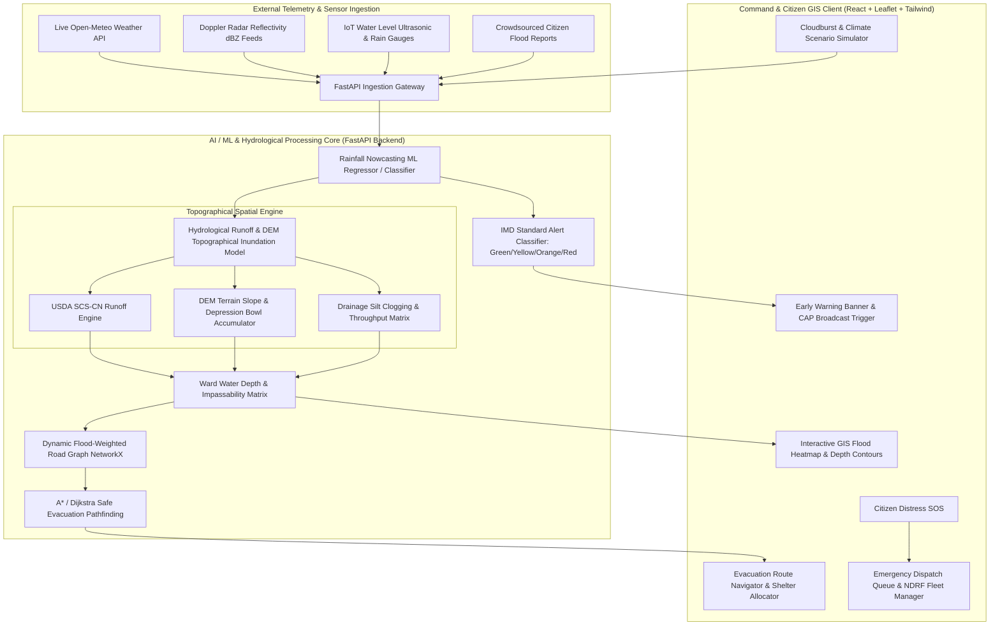

# JalPrahari AI — Technical Architecture & System Design Document

## 1. High-Level System Architecture

---

## 2. Mathematical & Hydrological Formulations

### 2.1 Doppler Radar Rain Rate Conversion (Marshall-Palmer Equation)
The radar reflectivity factor $Z$ ($\text{mm}^6/\text{m}^3$) is converted to precipitation rate $R$ ($\text{mm}/\text{h}$) via:
$$Z = 200 \cdot R^{1.6}$$
In logarithmic decibels ($\text{dBZ}$):
$$\text{dBZ} = 10 \cdot \log_{10}(Z)$$

### 2.2 USDA SCS-CN Surface Runoff Volume
The direct depth of surface water runoff $Q$ ($\text{mm}$) is determined by:
$$Q = \begin{cases} 
\frac{(P - I_a)^2}{P - I_a + S} & \text{if } P > I_a \\ 
0 & \text{if } P \le I_a 
\end{cases}$$
Where:
- $P$ = Total storm precipitation ($\text{mm}$)
- $I_a = 0.2 \cdot S$ (Initial abstraction: interception, depression storage, initial infiltration)
- $S = \frac{25400}{CN} - 254$ (Potential maximum soil retention)
- $CN \in [75, 95]$ (Hydrological Soil Group & Urban Imperviousness index)

### 2.3 Topographical Depression Inundation Depth
The local water depth $\Delta W_i$ in ward $i$ is formulated as:
$$\Delta W_i = \left(\frac{Q_{net, i}}{\text{Area}_i}\right) \cdot \left(\frac{1}{1 + \alpha \cdot (\text{Elev}_i - \text{Elev}_{min}) + \beta \cdot \tan(\theta_i)}\right)$$
Where:
- $\text{Elev}_i$ is the ward elevation above mean sea level ($\text{m}$).
- $\theta_i$ is the average terrain slope ($\text{degrees}$).
- $\alpha, \beta$ are topographical scaling constants calibrated for urban basin geometries.

### 2.4 Dynamic Flood-Weighted Evacuation Graph
For a road graph $G = (V, E)$, edge traversal weight $W(u, v)$ is calculated as:
$$W(u, v) = \text{Distance}(u, v) \cdot \begin{cases}
1.0 & \text{if } D_{water} < 0.15\text{ m} \quad (\text{Clear}) \\
4.0 & \text{if } 0.15\text{ m} \le D_{water} < 0.35\text{ m} \quad (\text{Caution}) \\
10^4 & \text{if } D_{water} \ge 0.35\text{ m} \quad (\text{Impassable / Blocked})
\end{cases}$$
The shortest safe path $P^*$ to an operational relief shelter $S \in \mathcal{S}$ is then solved via Dijkstra's algorithm:
$$P^* = \arg\min_{P \in \mathcal{P}} \sum_{e \in P} W(e)$$

---

## 3. REST API Endpoint Specifications

| Endpoint | Method | Description |
| :--- | :--- | :--- |
| `/api/v1/weather/telemetry` | `GET` | Ingests atmospheric telemetry from Open-Meteo or simulation engine |
| `/api/v1/ml/nowcast` | `POST` | Executes ML Rainfall Nowcasting ($1h, 3h, 6h, 24h$) & IMD Alerts |
| `/api/v1/simulation/inundation` | `POST` | Computes ward inundation depth, submerged area & risk levels |
| `/api/v1/routing/evacuation-path` | `POST` | Solves dynamic flood-avoidance path to nearest relief center |
| `/api/v1/sensors/telemetry` | `GET` | Returns live telemetry for simulated IoT water level gauges |
| `/api/v1/citizen/sos` | `POST` | Logs citizen emergency rescue request with GPS & triage notes |
| `/api/v1/citizen/sos-list` | `GET` | Retrieves active distress beacons for Disaster Management Command |
| `/api/v1/citizen/report` | `POST` | Submits crowdsourced ground waterlogging photos and notes |
